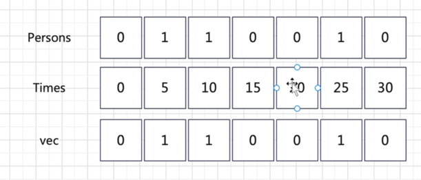

# 一、先获取times之后的投票结果
`
public TopVotedCandidate(int[] persons, int[] times){}
`
## 二、对投票结果进行二分查找t
`public int q(int t) {}`

### 【二分】找到最大的，比t小的，那个time

# 三、复杂度分析
## 时间复杂度
时间复杂度：预处理的时间复杂度为 O(N)，N为 persons 的长度。单次查询的时间复杂度为
单次查询的时间复杂度为O(logN)
## 空间复杂度
空间复杂度： O(N)。
## 原题地址
https://leetcode-cn.com/problems/online-election/